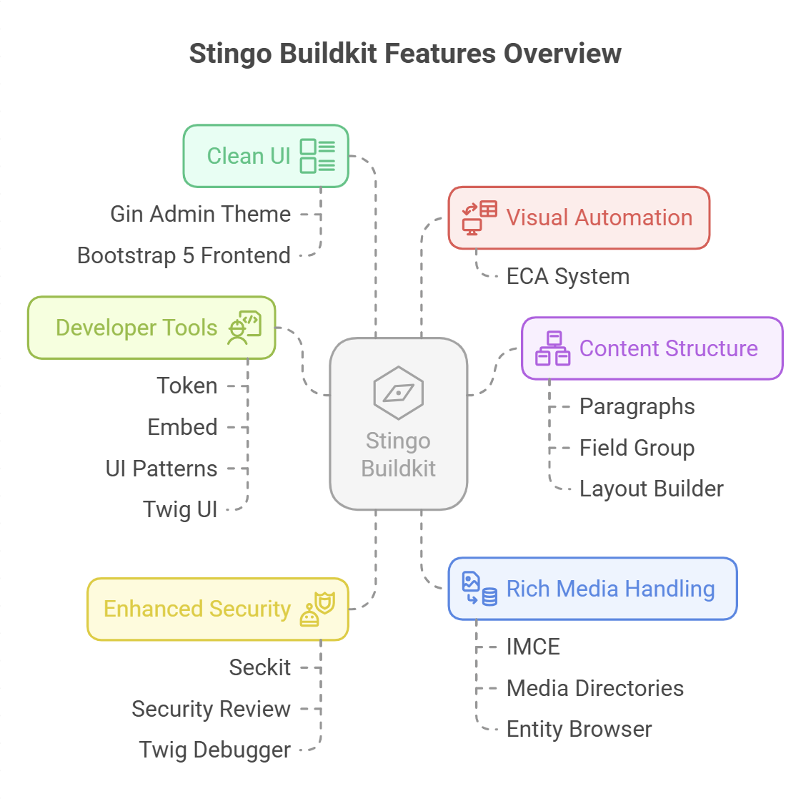

# Stingo Buildkit

**Stingo Buildkit** is a custom Drupal 10.5.3 starter kit with a powerful set of modules and themes to accelerate the development of modern, secure, and flexible Drupal websites. It is built on top of Drupal's core, leveraging best practices and essential site-building tools out of the box.

---


---

## 📦 Included Modules

This buildkit comes pre-installed with the following modules:

- `admin_toolbar`
- `block_class`
- `block_content_permissions`
- `bootstrap_layout_builder`
- `bootstrap_styles`
- `bpmn_io`
- `captcha`
- `ckeditor5_plugin_pack`
- `ckeditor5_premium_features`
- `conditional_fields`
- `css_editor`
- `easy_email`
- `eca`
- `embed`
- `entity_browser`
- `entity_embed`
- `entity_reference_revisions`
- `events_log_track`
- `field_group`
- `field_permissions`
- `filefield_paths`
- `gin_toolbar`
- `imce`
- `jquery_ui`
- `jquery_ui_resizable`
- `layout_options`
- `media_directories`
- `media_library_form_element`
- `paragraphs`
- `seckit`
- `security_review`
- `symfony_mailer`
- `token`
- `twig_debugger`
- `twig_ui`
- `ui_patterns`
- `ui_styles`
- `views_bulk_operations`
- `views_field_permissions`
- `reroute_emails`
- `autotitle`
- `disable_messages`
---

## 🎨 Included Themes

- `bootstrap5` – Responsive front-end theme using Bootstrap 5
- `gin` – Clean, modern administration theme
- `ui_suite_bootstrap` – Component-driven theming with UI Suite integration

---

## 🛠️ Installation Guide

### ✅ Step 1: Create a New Project

```bash
composer create-project stingo/buildkit my_project
cd my_project
```

---

### 🛢️ Step 2: Create a MySQL Database

```bash
mysql -u root -p
```

Then run these commands inside the MySQL prompt:

```sql
CREATE DATABASE stingo_buildkit CHARACTER SET utf8mb4 COLLATE utf8mb4_general_ci;
GRANT ALL PRIVILEGES ON stingo_buildkit.* TO 'root'@'localhost' IDENTIFIED BY 'your_db_password';
FLUSH PRIVILEGES;
EXIT;
```

> 🔐 Replace `'your_db_password'` with your actual MySQL password.

---

### ⚙️ Step 3: Install the Site via Drush

```bash
drush si stingo_buildkit \
  --site-name="Stingo Site" \
  --account-name=admin \
  --account-pass=admin123 \
  --account-mail=admin@example.com 

```

> Replace `your_db_password` with your actual MySQL root password.